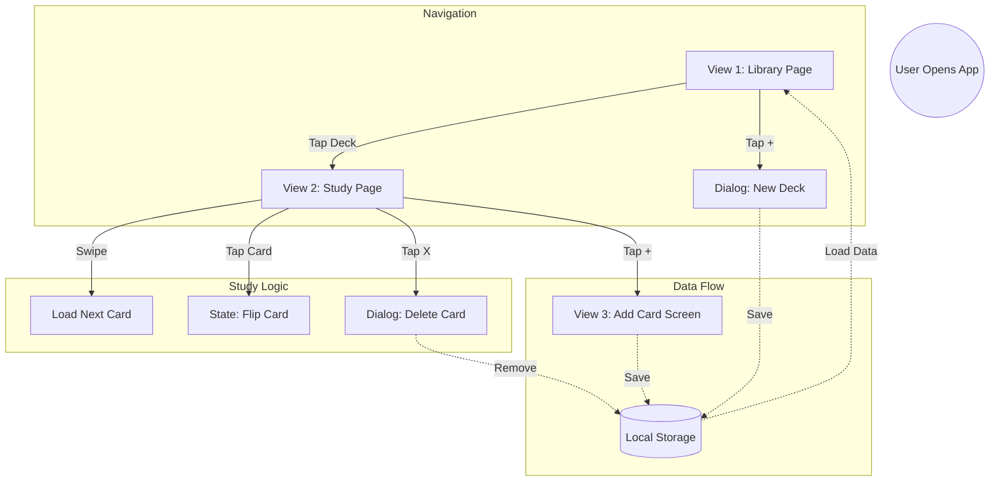

# Flashcard Pro 🎴

A modern, gesture-based flashcard application built with Flutter. Designed to help users memorize concepts efficiently using a clean, distraction-free interface with "swipe-to-study" mechanics.


## 📖 Overview

This project was built to solve a personal need for a simple, aesthetic study tool. Unlike complex alternatives, Flashcard Pro focuses on the essentials: creating decks, adding cards, and studying with intuitive gestures.

**Key Features:**
* **📚 Deck Management:** Organize cards into specific "Decks" (e.g., Biology, Spanish) with colorful pastel icons.
* **👆 Card Interaction:** Tap cards to flip between question and answer. Swipe through cards using the card stack interface.
* **🗑️ Delete Functionality:** Remove cards with a confirmation dialog via the X button on each card.
* **🌗 Adaptive Theme:** Automatically switches between Light (Latte) and Dark (Macchiato) modes based on system settings using the Catppuccin color palette.
* **💾 Persistent Storage:** All decks and cards are saved locally on the device using `SharedPreferences`.
* **📐 Responsive Design:** Cards feature auto-sizing text to handle long questions or answers without breaking the UI.

## 🏗️ App Architecture

The app follows a clear navigation flow centered around three main views.



## 🛠️ Tech Stack & Packages

  * **Framework:** Flutter (Dart)
  * **State Management:** `setState` (Native)
  * **Local Database:** `shared_preferences`
  * **UI Components:**
      * `flutter_card_swiper: ^7.0.0`: For the gesture-based card stack.
      * `auto_size_text: ^3.0.0`: To handle dynamic text scaling on cards.
      * `shared_preferences: ^2.2.0`: For local data persistence.

## 🎨 Design System

The app utilizes the **Catppuccin** color palette for a soft, high-contrast look that is easy on the eyes during late-night study sessions.

| Mode | Background | Surface | Text |
| :--- | :--- | :--- | :--- |
| **Light (Latte)** | `#EFF1F5` | `#CCD0DA` | `#4C4F69` |
| **Dark (Macchiato)** | `#24273A` | `#363A4F` | `#CAD3F5` |

## 🚀 Getting Started

1.  **Clone the repository:**
    ```bash
    git clone <your-repo-url>
    ```
    *Note: Replace `<your-repo-url>` with your actual repository URL.*
2.  **Install dependencies:**
    ```bash
    flutter pub get
    ```
3.  **Run the app:**
    ```bash
    flutter run
    ```

-----

*Built with ❤️ in Flutter.*

```
```